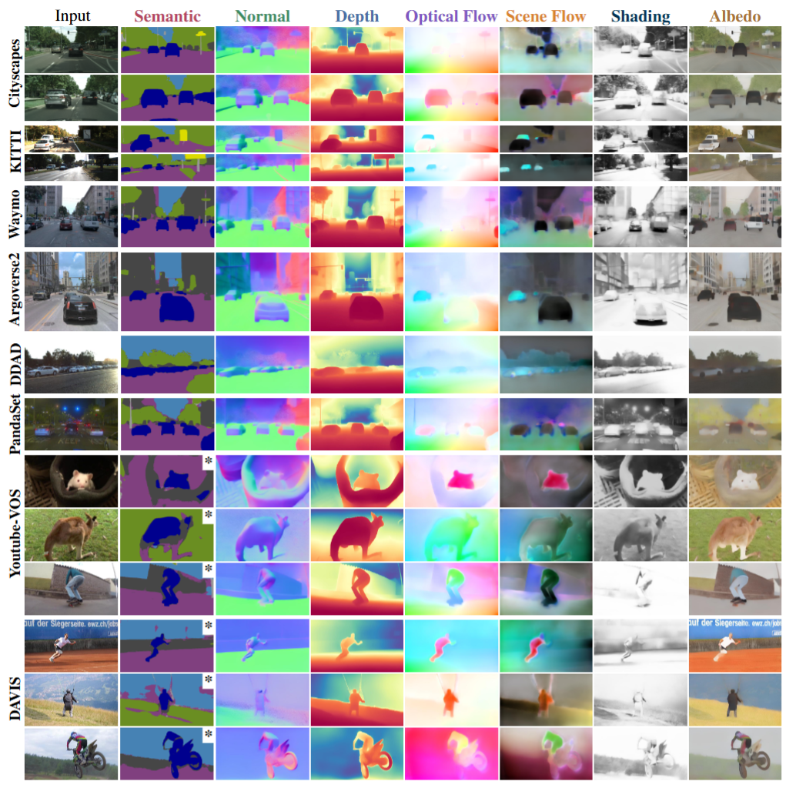

<div align="center">
  
# StableMTL: Repurposing Latent Diffusion Models for Multi-Task Learning from Partially Annotated Synthetic Datasets

[Anh-Quan Cao](https://anhquancao.github.io)<sup>1</sup>&nbsp;&nbsp;&nbsp;
[Ivan Lopes](https://ivnlps.github.io)<sup>2</sup>&nbsp;&nbsp;&nbsp;
[Raoul de Charette](https://rdecharette.github.io/)<sup>2</sup>&nbsp;&nbsp;&nbsp;

<div>
<sup>1</sup> Valeo.ai &nbsp;|&nbsp; <sup>2</sup> Inria
</div>

<br/>

[](https://arxiv.org/abs/2506.08013) <!-- TODO: Update with actual arXiv ID --> 
<!-- [](https://github.com/astra-vision/StableMTL) -->

<br/>


<!--https://github.com/user-attachments/assets/141947ea-7ad7-444b-8320-6cb881a093db -->


<!--  -->

</div>

## 📝 Citation

If you find this work or code useful, please cite our [paper](https://arxiv.org/abs/2506.08013) and [give this repo a star ⭐](https://github.com/astra-vision/StableMTL/stargazers):

```bibtex
@InProceedings{stablemtl,
    title     = {StableMTL: Repurposing Latent Diffusion Models for Multi-Task Learning from Partially Annotated Synthetic Datasets}, 
    author    = {Anh-Quan Cao and Ivan Lopes and Raoul de Charette},
    year      = {2025},
    booktitle = {arXiv}
}
```


## 📋 Table of Contents
- [1. 📦 Installation](#1--installation)
- [2. ⚙️ Environment Variables Setup](#2-%EF%B8%8F-environment-variables-setup)
- [3. 🗄️ Datasets](#3-%EF%B8%8F-datasets)
  - [3.1. 🏙️ Hypersim](#31-%EF%B8%8F-hypersim)
  - [3.2. 🚗 vkitti](#32--vkitti)
  - [3.3. ✈️ FlyingThings3D](#33-%EF%B8%8F-flyingthings3d)
  - [3.4. 🏙️ Cityscapes](#34-%EF%B8%8F-cityscapes)
  - [3.5. 🚘 KITTI flow 2015](#35--kitti-flow-2015)
  - [3.6. 📏 KITTI depth](#36--kitti-depth)
  - [3.7. 🔍 DIODE](#37--diode)
  - [3.8. 💡 MID Intrinsic](#38--mid-intrinsic)
  - [3.9. 📂 Dataset Structure](#39--dataset-structure)
- [5. 📊 Evaluation](#5--evaluation)
  - [5.1. 🔄 Single-stream model](#51--single-stream-model)
  - [5.2. 🔀 Multi-stream model](#52--multi-stream-model)
- [6. 🔬 Training](#6--training)
  - [6.1. 🧠 Pre-trained weights for training](#61--pre-trained-weights-for-training)
  - [6.2. 🔄 Single-stream model](#62--single-stream-model)
  - [6.3. 🔀 Multi-stream model](#63--multi-stream-model)
- [7. 🙏 Acknowledgement](#7--acknowledgement)

# 1. 📦 Installation

1. **Clone the repository**
   ```bash
   git clone https://github.com/astra-vision/StableMTL.git
   cd StableMTL
   ```

2. **Install PyTorch 2.3.1**
   ```bash
   # Install appropriate version for your CUDA setup
   pip install torch==2.3.1 torchvision==0.18.1
   ```

3. **Install dependencies**
   ```bash
   pip install --no-cache-dir -r requirements.txt
   ```

4. **Configure environment variables**
   ```bash
   source env.sh
   ```

# 2. ⚙️ Environment Variables Setup
Before proceeding with dataset downloads or model training/evaluation, you need to configure your environment.

1.  **Define Paths in `env.sh`**:
    Open the `env.sh` file in the root of this repository. Modify or add the following environment variables to point to your desired directories:
    *   `CODE_DIR`: Path to the StableMTL source code (e.g., `$(pwd)` if running from the repo root).
    *   `RAW_DATA_DIR`: Path where raw datasets will be downloaded.
    *   `PREPROCESSED_DIR`: Path where preprocessed datasets will be stored.
    *   `BASE_CKPT_DIR`: Path where base model checkpoints (like Stable Diffusion) will be stored.
    *   `OUTPUT_DIR`: Path where training outputs and resulting checkpoints will be saved.

2.  **Source `env.sh`**:
    After saving your changes to `env.sh`, source it in your terminal session:
    ```bash
    source env.sh
    ```
    You only need to do this once per terminal session, or whenever you open a new terminal or modify `env.sh`. All subsequent commands in this README assume these variables are correctly set.

# 3. 🗄️ Datasets
All dataset download and preprocessing scripts expect the environment variables (`CODE_DIR`, `RAW_DATA_DIR`, `PREPROCESSED_DIR`) to be set as described above. Make sure you have sourced `env.sh` before running any scripts.

## 3.1. 🏙️ Hypersim
1. **Download Hypersim dataset**

   - Download [Hypersim](https://github.com/apple/ml-hypersim) dataset using [this script](https://github.com/apple/ml-hypersim/blob/20f398f4387aeca73175494d6a2568f37f372150/code/python/tools/dataset_download_images.py).

   - Download the scene split file from [here](https://github.com/apple/ml-hypersim/blob/main/evermotion_dataset/analysis/metadata_images_split_scene_v1.csv).

   - Hypersim dataset should be placed in `$RAW_DATA_DIR/Hypersim/evermotion_dataset/scenes`

   - Scene split file should be placed in `$CODE_DIR/data_split/hypersim/metadata_images_split_scene_v1.csv`

2. **Preprocess Hypersim dataset**
   ```bash
   python $CODE_DIR/dataset_preprocess/hypersim/preprocess_hypersim.py \
       --output_dir $PREPROCESSED_DIR/hypersim \
       --split_csv $CODE_DIR/data_split/hypersim/metadata_images_split_scene_v1.csv \
       --dataset_dir $RAW_DATA_DIR/Hypersim/evermotion_dataset/scenes
   ```


## 3.2. 🚗 vkitti
1. **Download vkitti to `$RAW_DATA_DIR/VirtualKitti2`**
   ```bash
   wget http://download.europe.naverlabs.com//virtual_kitti_2.0.3/vkitti_2.0.3_rgb.tar
   wget http://download.europe.naverlabs.com//virtual_kitti_2.0.3/vkitti_2.0.3_depth.tar
   wget http://download.europe.naverlabs.com//virtual_kitti_2.0.3/vkitti_2.0.3_forwardFlow.tar
   wget http://download.europe.naverlabs.com//virtual_kitti_2.0.3/vkitti_2.0.3_classSegmentation.tar
   wget http://download.europe.naverlabs.com//virtual_kitti_2.0.3/vkitti_2.0.3_forwardSceneFlow.tar
   ```

2. **Create a symlink from the original dataset to the preprocessed directory**
   ```bash
   ln -s $RAW_DATA_DIR/VirtualKitti2 $PREPROCESSED_DIR/vkitti_v2/original
   ```

3. **Generate normal maps**
   ```bash
   cd $CODE_DIR/depth-to-normal-translator/python
   python process_vkitti2.py --output_root $PREPROCESSED_DIR/vkitti_v2
   ```

## 3.3. ✈️ FlyingThings3D

1. **Create directory and download dataset**
   ```bash
   source env.sh
   mkdir $RAW_DATA_DIR/FlyingThings3D
   cd $RAW_DATA_DIR/FlyingThings3D
   bash $CODE_DIR/dataset_preprocess/flying_things_3D/download_flying3d.sh
   ```

2. **Download dataset components**
   ```bash
   source env.sh
   cd $RAW_DATA_DIR/FlyingThings3D
   wget --no-check-certificate https://lmb.informatik.uni-freiburg.de/data/FlyingThings3D_subset/FlyingThings3D_subset_image_clean.tar.bz2
   wget --no-check-certificate https://lmb.informatik.uni-freiburg.de/data/FlyingThings3D_subset/FlyingThings3D_subset_flow.tar.bz2
   wget --no-check-certificate https://lmb.informatik.uni-freiburg.de/data/FlyingThings3D_subset/FlyingThings3D_subset_disparity.tar.bz2
   wget --no-check-certificate https://lmb.informatik.uni-freiburg.de/data/FlyingThings3D_subset/FlyingThings3D_subset_disparity_change.tar.bz2
   wget --no-check-certificate https://lmb.informatik.uni-freiburg.de/data/FlyingThings3D_subset/FlyingThings3D_subset_flow_occlusions.tar.bz2
   ```

3. **Extract the dataset**
   ```bash
   source env.sh
   tar -xvf FlyingThings3D_subset_image_clean.tar.bz2 -C $RAW_DATA_DIR
   tar -xvf FlyingThings3D_subset_flow.tar.bz2 -C $RAW_DATA_DIR
   tar -xvf FlyingThings3D_subset_disparity.tar.bz2 -C $RAW_DATA_DIR
   tar -xvf FlyingThings3D_subset_disparity_change.tar.bz2 -C $RAW_DATA_DIR
   tar -xvf FlyingThings3D_subset_flow_occlusions.tar.bz2 -C $RAW_DATA_DIR
   ```

4. **Preprocess FlyingThings3D dataset**
   ```bash
   source env.sh
   python $CODE_DIR/dataset_preprocess/flying_things_3D/preprocess.py \
       --input_dir $RAW_DATA_DIR/FlyingThings3D_subset \
       --output_dir $PREPROCESSED_DIR/FlyingThings3D_preprocessed
   ```

## 3.4. 🏙️ Cityscapes

1. **Download Cityscapes dataset**
   > Remember to replace `myusername` and `mypassword` with your Cityscapes account credentials.
   ```bash
   wget --keep-session-cookies --save-cookies=cookies.txt --post-data 'username=myusername&password=mypassword&submit=Login' https://www.cityscapes-dataset.com/login/
   
   wget --load-cookies cookies.txt --content-disposition https://www.cityscapes-dataset.com/file-handling/?packageID=1 # gtFine_trainvaltest.zip
   wget --load-cookies cookies.txt --content-disposition https://www.cityscapes-dataset.com/file-handling/?packageID=3 # leftImg8bit_trainvaltest.zip
   ```

2. **Extract the dataset**
   ```bash
   source env.sh
   mkdir -p $PREPROCESSED_DIR/cityscapes
   unzip gtFine_trainvaltest.zip -d $PREPROCESSED_DIR/cityscapes
   unzip leftImg8bit_trainvaltest.zip -d $PREPROCESSED_DIR/cityscapes
   ```

## 3.5. 🚘 KITTI flow 2015

1. **Download KITTI flow 2015 dataset**
   ```bash
   source env.sh
   mkdir -p $PREPROCESSED_DIR/kitti/flow_2015
   cd $PREPROCESSED_DIR/kitti/flow_2015
   
   wget https://s3.eu-central-1.amazonaws.com/avg-kitti/data_scene_flow.zip
   wget https://s3.eu-central-1.amazonaws.com/avg-kitti/data_scene_flow_calib.zip
   ```

2. **Extract the dataset**
   ```bash
   source env.sh
   unzip data_scene_flow.zip -d $PREPROCESSED_DIR/kitti/flow_2015
   unzip data_scene_flow_calib.zip -d $PREPROCESSED_DIR/kitti/flow_2015
   ```

## 3.6. 📏 KITTI depth

1. **Download KITTI eigen test split**
   ```bash
   source env.sh
   wget https://share.phys.ethz.ch/~pf/bingkedata/marigold/evaluation_dataset/kitti/kitti_eigen_split_test.tar
   ```

2. **Extract the dataset**
   ```bash
   source env.sh
   mkdir -p $PREPROCESSED_DIR/kitti/kitti_eigen_split_test
   tar -xvf kitti_eigen_split_test.tar -C $PREPROCESSED_DIR/kitti/kitti_eigen_split_test
   ```

## 3.7. 🔍 DIODE

1. **Download DIODE validation depth and normal dataset**
   ```bash
   wget http://diode-dataset.s3.amazonaws.com/val.tar.gz
   wget http://diode-dataset.s3.amazonaws.com/val_normals.tar.gz
   ```

2. **Extract and organize the dataset**
   ```bash
   source env.sh
   mkdir -p $PREPROCESSED_DIR/diode
   tar -xvf val.tar.gz -C $PREPROCESSED_DIR/diode
   tar -xvf val_normals.tar.gz -C $PREPROCESSED_DIR/diode
   mv $PREPROCESSED_DIR/diode/val $PREPROCESSED_DIR/diode/diode_val
   ```

## 3.8. 💡 MID Intrinsic

1. **Download MID Intrinsic dataset and albedo ground truth**
   ```bash
   source env.sh
   wget https://data.csail.mit.edu/multilum/multi_illumination_test_mip2_exr.zip
   wget https://huggingface.co/anhquancao/StableMTL/resolve/main/midi_test_albedo.zip
   ```

2. **Extract the dataset**
   ```bash
   source env.sh
   mkdir -p $RAW_DATA_DIR/mid_intrinsics/test
   unzip multi_illumination_test_mip2_exr.zip -d $RAW_DATA_DIR/mid_intrinsics/test
   unzip midi_test_albedo.zip -d $RAW_DATA_DIR/mid_intrinsics/test
   ```

3. **Preprocess the dataset**
   ```bash
   source env.sh
   python $CODE_DIR/dataset_preprocess/mid_intrinsics/preprocess.py \
       --input_dir $RAW_DATA_DIR/mid_intrinsics \
       --output_dir $PREPROCESSED_DIR/mid_intrinsics
   ```

## 3.9. 📂 Dataset Structure

After downloading and preprocessing, your dataset structure should be organized as follows:

```
$PREPROCESSED_DIR/
├── cityscapes/              # Cityscapes dataset
├── diode/                  # DIODE depth and normal dataset
│   └── diode_val/
├── FlyingThings3D_preprocessed/  # FlyingThings3D dataset
├── hypersim/               # Hypersim dataset
│   └── train/
├── kitti/                  # KITTI datasets
│   ├── flow_2015/          # KITTI flow dataset
│   └── kitti_eigen_split_test/  # KITTI depth dataset
├── mid_intrinsics/         # MID Intrinsic dataset
└── vkitti_v2/              # Virtual KITTI dataset
    └── original/           # Symlink to original vkitti data
```

> **Note**: Make sure all datasets are properly downloaded and preprocessed before proceeding to the evaluation or training steps.


# 5. 📊 Evaluation

## 5.1. 🔄 Single-stream model

1. **Download and extract checkpoint**
   ```bash
   source env.sh
   wget https://huggingface.co/anhquancao/StableMTL/resolve/main/single_stream.tar.gz -O $OUTPUT_DIR/single_stream.tar.gz
   tar -xvf $OUTPUT_DIR/single_stream.tar.gz -C $OUTPUT_DIR
   ```

2. **Run evaluation**
   ```bash
   source env.sh
   python eval_mtl.py --config config/dataset/dataset_test.yaml \
       --resume_run=$OUTPUT_DIR/single_stream/checkpoint/latest \
       --base_ckpt_dir=$BASE_CKPT_DIR --base_data_dir=$PREPROCESSED_DIR
   ```

   > This will evaluate the single-stream model on all test datasets configured in the dataset_test.yaml file.

## 5.2. 🔀 Multi-stream model

1. **Download and extract checkpoint**
   ```bash
   source env.sh
   wget https://huggingface.co/anhquancao/StableMTL/resolve/main/multi_stream.tar.gz -O $OUTPUT_DIR/multi_stream.tar.gz
   tar -xvf $OUTPUT_DIR/multi_stream.tar.gz -C $OUTPUT_DIR
   ```

2. **Download pre-trained single-stream UNet checkpoint**
   > The multi-stream model uses components from the single-stream UNet
   ```bash
   source env.sh
   mkdir -p $CODE_DIR/checkpoint
   wget https://huggingface.co/anhquancao/StableMTL/resolve/main/single_stream_unet.pth -O $CODE_DIR/checkpoint/single_stream_unet.pth
   ```

3. **Run evaluation**
   ```bash
   source env.sh
   python eval_mtl.py --config config/dataset/dataset_test.yaml \
       --resume_run=$OUTPUT_DIR/multi_stream/checkpoint/latest \
       --base_ckpt_dir=$BASE_CKPT_DIR --base_data_dir=$PREPROCESSED_DIR
   ```

   > This will evaluate the multi-stream model on all test datasets configured in the dataset_test.yaml file.

# 6. 🔬 Training

## 6.1. 🧠 Pre-trained weights for training

### 6.1.1. 🖼️ Stabilityai/stable-diffusion-2

> This is needed to train the single-stream model

1. **Create base checkpoint directory**
   ```bash
   source env.sh
   mkdir -p $BASE_CKPT_DIR
   ```

2. **Download checkpoint from Hugging Face**
   ```python
   from huggingface_hub import snapshot_download
   snapshot_download(repo_id="stabilityai/stable-diffusion-2")
   ```

3. **Create a symlink from the original checkpoint to the base checkpoint directory**
   ```bash
   ln -s ~/.cache/huggingface/hub/models--stabilityai--stable-diffusion-2/snapshots/1e128c8891e52218b74cde8f26dbfc701cb99d79 $BASE_CKPT_DIR/stable-diffusion-2
   ```

### 6.1.2. 📊 Pre-trained single-stream checkpoint

> This is needed to train the multi-stream model

**Download pre-trained single-stream checkpoint**
```bash
source env.sh
wget https://huggingface.co/anhquancao/StableMTL/resolve/main/single_stream_unet.pth -O $BASE_CKPT_DIR/single_stream_unet.pth
```

## 6.2. 🔄 Single-stream model

**Train the single-stream model**
```bash
source env.sh
python train_stablemtl.py --config config/train_stablemtl_s.yaml \
    --subfix=SingleStream \
    --output_dir=$OUTPUT_DIR \
    --base_ckpt_dir=$BASE_CKPT_DIR --base_data_dir=$PREPROCESSED_DIR
```

## 6.3. 🔀 Multi-stream model

> Make sure you have downloaded the pre-trained single-stream checkpoint as described in section 6.1.2

### Single GPU training

```bash
source env.sh
python train_stablemtl.py --config config/train_stablemtl.yaml \
    --subfix=MultiStream \
    --output_dir=$OUTPUT_DIR \
    --base_ckpt_dir=$BASE_CKPT_DIR --base_data_dir=$PREPROCESSED_DIR
```

### Multi-GPU training

```bash
source env.sh
accelerate launch --config_file config/accelerator/multigpus_2_fp32.yaml \
    --main_process_port 29512 \
    train_stablemtl.py --config config/train_stablemtl.yaml \
    --n_gpus=2 \
    --subfix=MultiStream \
    --output_dir=$OUTPUT_DIR \
    --base_ckpt_dir=$BASE_CKPT_DIR --base_data_dir=$PREPROCESSED_DIR
```


# 7. 🙏 Acknowledgement

This code builds upon the following excellent open-source repositories:

- [**Marigold**](https://github.com/prs-eth/Marigold)
- [**Lotus**](https://github.com/EnVision-Research/Lotus)
- [**MID Intrinsics**](https://github.com/compphoto/MIDIntrinsics)
- [**Tune-A-Video**](https://github.com/showlab/Tune-A-Video)
- [**DenseMTL**](https://github.com/astra-vision/DenseMTL)


This work was supported by the French Agence Nationale de la Recherche (ANR) under project SIGHT (ANR-20-CE23-0016). Computations were performed using HPC resources from GENCI-IDRIS (Grants AD011014102R2, AD011014102R1, AD011014389R1, and AD011012808R3). The authors also thank the CLEPS infrastructure at Inria Paris for additional support.
